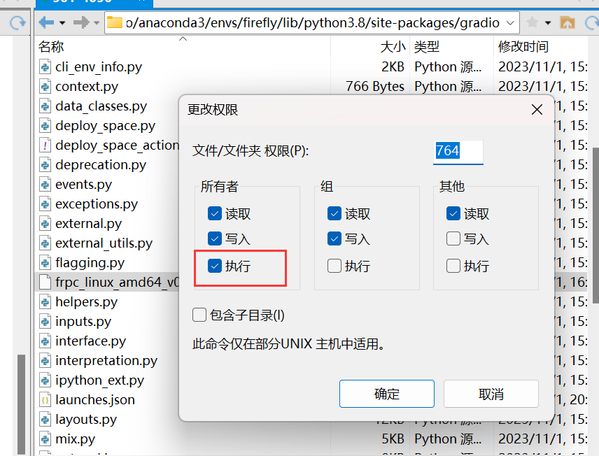

# TODAY-LLM 说明文档

## 环境配置
```
conda create -n env_name python==3.8
pip install -r requirements.txt
```
## NER和RE数据处理
执行data/instruct_create路径下的trans_ner.py和trans_re.py文件即可将原始的NER和RE数据构造成指令数据。注意修改输入文件和输出文件路径。

## 模型一阶段训练
```
torchrun --nproc_per_node=2 train_qlora.py --train_args_file train_args/qlora/qwen-7b-sft-qlora.json
```
根据实际显卡数量设置nproc_per_node，train_args_file为qlora参数文件位置。第一阶段训练数据为医学QA，NER，RE。

## 模型二阶段训练
```
torchrun --nproc_per_node=2 train_qlora_cpt.py --train_args_file train_args/qlora/qwen-7b-sft-qlora.json
```
第二阶段训练数据为MOSS通用对话数据及医学数据。

## 模型推理（单轮问答）
```
python generate_answer.py
```
将测试数据构造成流萤输入格式后，运行该行命令得到模型输出结果。注意修改py文件中输入文件路径和输出路径。

## 模型推理（多轮问答）
```
python generate_answer_multi.py
```

## 网页demo
运行网页demo文件前需要先安装几个包
```
pip install gradio==3.40
pip install bingbong
```
执行以下命令即可运行本地demo网页。
```
python app-Today.py
```
如果要将demo放到公网上需要将frpc_linux_amd64_v0.2文件移动到.../anaconda3/envs/firefly/lib/python3.8/site-packages/gradio路径下，并将权限更改为可执行。


## 致谢
本项目参考自[流萤项目](https://github.com/yangjianxin1/Firefly)。

## 引用
若使用本项目的数据、代码或模型，请引用本项目。
```text
@misc{TODAY-LLM,
  author = {Guangtao xu, Zhaoying Wen, Wenduo Feng, Yuqi Liu, Senbo Tu, Yongle Kong},
  title = {TODAY: 中文医学对话大模型},
  year = {2023},
  publisher = {GitHub},
  journal = {GitHub repository},
  howpublished = {\url{https://gitlab.com/dlut1/TODAY-LLM/-/tree/master?ref_type=heads}},
}
```

